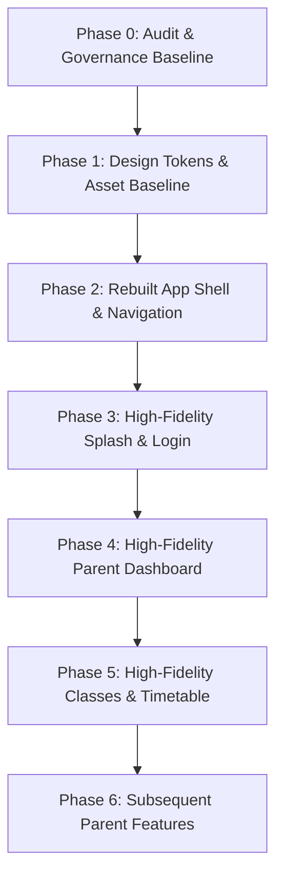

# 31 — Flutter Restart: Full Figma MCP & Project Audit (Phase 0)

> [!IMPORTANT]
> **PHASE 0 CONTROLLED RESTART AUDIT**
> - **Date**: 2026-09-08
> - **Objective**: Full Figma MCP + Flutter project audit to establish exact design source-of-truth, compare current Flutter UI against Figma, diagnose root causes of visual mismatch, classify existing code, and produce a structured restart implementation plan.
> - **Execution Rule**: Strict audit and documentation ONLY. Zero application features implemented, zero UI code modified, zero backend/web modified, zero dependencies added.

---

## 1. Executive Summary & Audit Objective

The TrueLern mobile project is executing a controlled restart of the Flutter presentation layer. While the core Flutter technical pipeline (Gradle build, Android compileSdk 37, device USB deployment, real JWT authentication against `https://truelern.visital.in/api`, secure storage persistence, Dio HTTP interceptors, Riverpod state propagation, and Dart analyze clean status) is verified and functional, the **visual fidelity of the Flutter UI fails to match the approved Figma designs**.

With the **Figma Dev Mode MCP server** actively connected and querying the authoritative Figma file (`CiZoTN0EnITFG3e7SFwXrU`), this audit inspects the actual Figma document/node tree, compares it against the existing Flutter codebase, identifies exact discrepancies, and sets an unassailable roadmap for rebuilding the presentation layer.

---

## 2. Figma MCP Connection & Page Verification

### 2.1 Connection Verification
- **MCP Server**: `figma-dev-mode-mcp-server`
- **Connection Status**: **PASS (ACTIVE & VERIFIED)**
- **Figma File Key**: `CiZoTN0EnITFG3e7SFwXrU` (`TrueLern`)
- **Top-Level Document Pages Discovered via MCP (`get_metadata`)**:
  1. `28:2`: `Truelern_student` (Phase 1B — **NOT STARTED / STRICTLY OUT OF SCOPE**)
  2. `69:2`: `Parent(full app)_TreLern` (Phase 1A Parent Scope — **PRIMARY TARGET**)

### 2.2 MCP Capabilities & Limitations Verified
- **Capabilities Verified**:
  - `get_metadata`: Successfully dumps the complete node tree, layout positions, frame names, dimensions, and hierarchy for the entire Parent canvas (6,136 lines of XML, 44 top-level frames/components).
  - `get_design_context`: Returns exact CSS properties, auto-layout parameters, hex colors, font families, font sizes, line heights, border radii, drop shadows, and image asset CDN URLs.
- **Limitations**:
  - Figma Dev Mode MCP returns React/Tailwind representations of design nodes that must be systematically translated into Flutter Widgets without installing web dependencies.
  - Vector icons are provided as localhost SVG URLs from the Figma daemon, which requires downloading and embedding them as local Flutter SVGs rather than using approximate generic Material Icons.

---

## 3. Verified Figma Screen Inventory (From MCP Inspection)

Inspection of canvas `69:2` (`Parent(full app)_TreLern`) reveals **44 top-level frames/components**:

| Node ID | Figma Frame Name | Role / Classification | Dimensions | Scope / Category |
|:---|:---|:---:|:---:|:---|
| `71:3` | `App Icon Launcher (Production)` | Asset Spec Frame | 390x1584 | Spec / Design System Assets |
| `71:128` | `Splash Screen (Production)` | **SCR-01** Navigable Screen | 390x907 | Bootstrap & Splash Flow |
| `71:150` | `Onboarding: Learn with Fun` | **SCR-02** Onboarding Step 1 | 390x902 | Onboarding Flow |
| `71:179` | `Onboarding: Grow Every Day` | **SCR-02** Onboarding Step 2 | 390x902 | Onboarding Flow |
| `71:208` | `Onboarding: Learning Without Limits` | **SCR-02** Onboarding Step 3 | 390x907 | Onboarding Flow |
| `71:232` | `Student Login (Redesign)` | **SCR-03** Login Screen | 390x966 | Primary Auth Screen (Parent & Student shared) |
| `71:270` | `Student Login (IF_WP_LOGIN)` | Alternative Login Variant | 390x960 | Auth Variant |
| `71:303` | `Student Login (Redesign)` | Variant / Iteration | 390x966 | Auth Variant |
| `71:348` | `Student Login (Redesign)` | Variant / Iteration | 401x966 | Auth Variant |
| `71:389` | `Student Login (Redesign)` | Variant / Iteration | 390x966 | Auth Variant |
| `71:427` | `Student Login (Redesign)` | Variant / Iteration | 390x966 | Auth Variant |
| `71:74` | `Offline Dashboard (Production)` | **SCR-17** Offline Fallback | 390x984 | Offline Fallback State |
| `72:477` | `Demo Booking Dashboard` | **SCR-37** Demo Booking Form | 390x1394 | Lead Generation / Trial |
| `74:624` | `Demo Booking Confirmation Popup`| **SCR-37** Overlay | 390x1394 | Lead Gen Confirmation |
| `75:793` | `Demo Booking Confirmed Popup` | **SCR-38** Modal Overlay | 390x1394 | Lead Gen Success Modal |
| `76:3476`| `Student Dashboard` | **SCR-09** Parent/Student Dashboard | 390x1283 | **Parent Dashboard (Main)** |
| `76:1820`| `Classes Shedule` | **SCR-13** Classes Screen | 390x952 | **Classes & Timetable (Main)** |
| `76:2063`| `Class Details (Revised)` | **SCR-14** Detail Screen | 390x1416 | Class Detail View |
| `76:3154`| `Ready to Join (Revised)` | Class Pre-join Overlay | 390x1258 | Observation View / Detail |
| `76:3263`| `Joining Class (Revised)` | Connecting State Screen | 390x894 | Live Stream / Transition |
| `76:2191`| `Live Classroom (New)` | Live Classroom Screen | 390x884 | Live Classroom Interface |
| `76:2253`| `Class Summary (Revised)` | Post-class Summary | 390x1111 | Session Feedback / Summary |
| `76:1943`| `Assignments` | **SCR-18** Assignments Hub | 390x1156 | Homework / Assignments Hub |
| `76:2374`| `Assignment Details (Revised)` | **SCR-19** Assignment Detail | 390x1581 | Assignment Rubric & Submission |
| `76:2474`| `Assignment Submission (Revised)`| Assignment Upload Modal | 390x1653 | Assignment Submission Flow |
| `76:2611`| `Assignment Submitted (Revised)` | Success Overlay | 390x1061 | Submission Confirmation |
| `76:2697`| `Teacher Feedback (Revised)` | **SCR-22** Feedback Screen | 390x1133 | Teacher Feedback & Grades |
| `76:2787`| `Current Program (New)` | Curriculum Roadmap | 390x1506 | Course Program Overview |
| `76:2930`| `Topic Detail (New)` | Topic Curriculum Detail | 390x1389 | Syllabus Module Detail |
| `76:3053`| `Learning Progress (New)` | **SCR-24** Progress Screen | 390x1305 | Attendance & Academic Progress |
| `76:962` | `My children` | **SCR-11** Ward Switcher | 390x1106 | Child Management Directory |
| `76:1711`| `Profile` | **SCR-26** User Profile | 390x974 | Parent Profile Screen |
| `76:1150`| `Messeges` | **SCR-27** Messages (Blocked) | 390x856 | Direct Messages (Out of Scope) |
| `76:1249`| `Hamburger Drawer — Default` | **SCR-35** Drawer Overlay | 390x1200 | Navigation Drawer |
| `76:1378`| `Notifications` | **SCR-28** Notifications Feed | 390x982 | Alerts & Notifications |
| `76:1485`| `Account Settings` | **SCR-36** Settings Screen | 390x1418 | Guardian Preferences |
| `76:1621`| `Achievements` | Recognition & Badges | 390x1083 | Student/Child Badges |
| `104:106`| `Invoices` | **SCR-32** Invoices List | 390x975 | Tuition Fee Billing List |
| `104:198`| `Invoice Detail` | **SCR-33** Invoice Item Detail | 390x988 | Fee Itemization & Breakdown |
| `104:294`| `Payment Successful` | **SCR-34** Dialog Modal | 390x1075 | Payment Receipt Dialog |
| `104:314`| `Security & Privacy` | **SCR-29** Security Screen | 390x1075 | Password & Security Settings |
| `104:462`| `Login Methods` | **SCR-30** Social / 2FA Screen | 390x896 | Auth Methods Setting |
| `104:530`| `Login & Devices` | **SCR-31** Device Token Revoke | 390x896 | Active Sessions List |

### 2.3 Discrepancies with Previous Documentation (`08-SCREEN-MASTER-INVENTORY.md`)
1. **Figma Canvas Name**:
   - Documented: `Parent(full app)_TreLern`
   - Verified via MCP: Exact match on canvas `69:2`.
2. **Dashboard Frame (`SCR-09`)**:
   - Documented: `Parent Dashboard`
   - Verified in Figma: The frame on canvas `69:2` is titled **`Student Dashboard` (`76:3476`)**. It serves as the unified dashboard for guardian and student, featuring a horizontal **Child Selector** (`Alex - Age 9`, `Mia - Age 12`), greeting `"Hi, Alex! Let's go on today's adventure!"`, Today's Class Card with left cyan border, and "My Learning" progress cards.
3. **Classes Frame (`SCR-13`)**:
   - Documented: `Class Schedule`
   - Verified in Figma: Titled **`Classes Shedule` (`76:1820`)**. Features a Pill Child Selector (`Alex`), a horizontal Date Navigator (`Mon 24`, `Tue 25`, `Wed 26`), Filter Tabs (`Upcoming`, `Completed`, `Missed`, `Cancelled`), 3D Calendar Icon empty state, and Event Cards.
4. **Bottom Navigation Items**:
   - Documented: 5 tabs (`Dashboard`, `Classes`, `Homework`, `Invoices`, `Profile`).
   - Verified in Figma (`BottomNavBar (Mobile)` on node `76:3477` / `76:1920`): Exactly **4 tabs**:
     1. **`Home`** (House icon)
     2. **`My Classes`** (Calendar/Video icon)
     3. **`Assignment`** (Clipboard/Document icon)
     4. **`Profile`** (User icon)
   - Financial Invoices are located in the **Hamburger Drawer** (`76:1249`), NOT as a bottom navigation bar tab.

---

## 4. Figma Design System Audit (Extracted via MCP)

### 4.1 Colors
- **Brand Primary Blue**: `#0037B1` (Deep Vibrant Royal Cobalt).
  - *Current Flutter code uses `#2563EB` (Tailwind Blue 600) or `#1E40AF`. This is an exact 1-to-1 mismatch with Figma.*
- **Secondary Blue / Buttons**: `#1E4ED8`
- **Accent Cyan / Class Tag**: `#22D3EE` (Border and tag background `rgba(34, 211, 238, 0.1)`)
- **Accent Teal / Course Progress**: `#14B8A6` (Background `rgba(20, 184, 166, 0.1)`)
- **Canvas Gradient**:
  - Dashboard: `linear-gradient(106.91deg, rgb(243, 232, 255) 0%, rgb(224, 242, 254) 50%, rgb(255, 255, 255) 100%)`
  - Classes: `linear-gradient(132.88deg, rgb(243, 232, 255) 0%, rgb(224, 242, 254) 50%, rgb(255, 255, 255) 100%)`
  - Splash: `linear-gradient(-54.54deg, #FFFFFF 0%, #E0E7FF 33.3%, rgba(30,78,216,0.2) 66.7%, #FFFFFF 100%)`
- **Card Surfaces**: Pure white `#FFFFFF` with glassmorphic backdrop filters (`backdrop-blur: 12px`, `bg: rgba(250,248,255,0.8)`).
- **Text Hierarchy**:
  - Dark Primary Headline: `#1A1B23` / `#0F172A` / `#191C1E`
  - Secondary Slate Body: `#434655` / `#475569`
  - Inactive / Placeholder: `#747686` / `#C4C5D7`

### 4.2 Typography
- **Authoritative Font Families in Figma**:
  1. **`Hanken Grotesk`**: The dominant typeface for all headings, dates, tabs, child selector chips, and card titles (`Bold`, `SemiBold`, `Medium`, `Regular`).
  2. **`Be Vietnam Pro`**: Secondary typeface used in Login cards, auth headers, and social dividers.
  - *Current Flutter code uses `GoogleFonts.inter()` everywhere. This is a primary cause of the visual divergence.*
- **Scale Hierarchy**:
  - Greeting / Hero: `28px`, Bold (line-height: `36px`)
  - Screen Title / App Bar: `24px`, Bold (line-height: `32px`)
  - Section Titles: `20px`, Bold (line-height: `28px`)
  - Card Headlines: `16px`, Bold / SemiBold (line-height: `24px`)
  - Body Text: `14px`, Regular (line-height: `20px`)
  - Date & Subtitle Meta: `11px` - `12px`, Medium (line-height: `16px`)

### 4.3 Geometry, Borders & Shadows
- **Card Corner Radii**:
  - Main Cards: `16px` (`rounded-[16px]`)
  - Login Card: `24px` (`rounded-[24px]`)
  - Bottom Navigation Bar: Top-left `24px`, Top-right `24px` (`rounded-tl-[24px] rounded-tr-[24px]`)
  - Date Pills: `8px` (`rounded-[8px]`)
  - Child Avatar / Filter Pills: `9999px` (Full capsules)
- **Shadows**:
  - Bottom Navigation Bar: `0px -4px 20px 0px rgba(0,0,0,0.04)`
  - Cards: `0px 4px 10px rgba(0,0,0,0.04)` and `0px 1px 1px rgba(0,0,0,0.05)`
  - Active Pills: `drop-shadow(0px 1px 1px rgba(0,0,0,0.05))`

---

## 5. Asset Audit

| Asset Description | Figma Source (`69:2`) | Current Flutter State | Action Required |
|:---|:---|:---:|:---|
| **TrueLern Dual-Tone Wordmark** | Img asset `image 1` + `image 2` on `71:144` | Generic `RichText('True', 'Lern')` | Export vector SVG/PNG from Figma; embed as local asset |
| **Splash Background Icons** | 7 ghosted floating vector icons on `71:129` | None (Blank white gradient) | Extract SVGs from Figma; render layered canvas |
| **Child Avatar Images (Alex & Mia)**| Real child photo assets on `76:3583` & `76:3592` | Single letter initials circle `CircleAvatar` | Extract Figma avatars as placeholders or network cache |
| **3D Calendar Illustration** | Real 3D rendered graphic on `76:1893` | Generic Flutter icon `Icons.calendar_today` | Export high-res PNG from Figma; embed in `assets/images/` |
| **Bottom Bar Navigation Icons** | Custom line SVG vectors on `76:3479` - `76:3497` | Generic `Icons.home_outlined`, `video_camera` | Export exact SVG assets; load via `flutter_svg` |
| **Login Google Icon** | Multi-colored Google G icon on `71:265` | Generic `Icons.g_mobiledata` | Export exact Google asset from Figma |
| **Child Selector Pill Affordance** | Custom circular avatar + text capsule | Custom Rectangular Banner | Rebuild to match Figma capsule with border badge |

---

## 6. Screen-by-Screen Visual Fidelity Audit

### 6.1 Splash Screen (Figma node `71:128` vs Flutter `lib/features/auth/presentation/screens/splash_screen.dart`)
- **Visual Fidelity**: **POOR (30% Match)**
- **Discrepancies**:
  - Figma has 7 ghosted floating educational icons distributed across the screen background; Flutter has none.
  - Figma background is a multi-stop diagonal gradient (`-54.54deg`, `#FFFFFF` -> `#E0E7FF` -> `rgba(30,78,216,0.2)`); Flutter uses a simple 2-stop vertical gradient.
  - Figma displays a 3px thin progress indicator at the bottom (`rgba(30,78,216,0.1)`); Flutter displays a generic circular spinner.
  - Figma displays subtle version text `v1.0.0` at bottom-center; Flutter displays a static marketing subtitle.

### 6.2 Login Screen (Figma node `71:232` vs Flutter `lib/features/auth/presentation/screens/login_screen.dart`)
- **Visual Fidelity**: **FAIR (50% Match)**
- **Discrepancies**:
  - Figma features soft abstract pastel glow blobs in the background (`rgba(183,196,255,0.3)` and `rgba(255,223,159,0.4)` with 32px blur); Flutter has a flat background.
  - Figma uses a frosted glass card with 24px radius, `rgba(255,255,255,0.85)` fill, and backdrop blur; Flutter uses a basic white container.
  - Primary button color in Figma is `#0037B1` with `Hanken Grotesk` SemiBold 16px; Flutter uses `#2563EB` with `Inter`.
  - Social divider in Figma has an enclosed pill around `"Or continue with"`; Flutter uses a flat text widget between dividers.
  - Google button in Figma has a 12px radius, min-height 56px, and genuine Google asset; Flutter uses an OutlinedButton with generic icon.

### 6.3 Parent Shell & Navigation (Figma node `76:3477` vs Flutter `lib/features/dashboard/presentation/screens/parent_shell_screen.dart`)
- **Visual Fidelity**: **POOR (40% Match)**
- **Discrepancies**:
  - Figma has **4 bottom tabs**: `Home`, `My Classes`, `Assignment`, `Profile`. Flutter implements **5 bottom tabs** including `Invoices`.
  - Figma bottom navigation bar has a distinctive top-rounded shape (`rounded-tl-[24px] rounded-tr-[24px]`), backdrop blur 12px, fill `rgba(250,248,255,0.8)`, and negative Y shadow (`0px -4px 20px rgba(0,0,0,0.04)`); Flutter uses a standard square rectangular container.
  - Active tab text color in Figma is `#0037B1`, inactive is `#747686` with `Hanken Grotesk Medium 12px`; Flutter uses `#2563EB` and `#94A3B8` with `Inter`.

### 6.4 Dashboard (Figma node `76:3476` vs Flutter `lib/features/dashboard/presentation/screens/parent_dashboard_screen.dart`)
- **Visual Fidelity**: **POOR (25% Match)**
- **Discrepancies**:
  - Figma top hero contains a horizontal scrollable **Child Capsule Selector** (`Alex - Age 9`, `Mia - Age 12`) with active white pill, blue border, and photo avatar; Flutter has a dark blue gradient card with text "Hi there! Let's check on Alex's learning today" and an anonymous user circle.
  - Figma featured section is **`TODAY'S CLASS`** with a white card, 4px cyan left accent border (`#22D3EE`), clock icon, instructor info, and a direct action button; Flutter displays a 2x2 grid of "Overview", "Homework", "Finance".
  - Figma displays **`My Learning`** course progress cards (`Junior Foundation`, 65% progress bar in `#14B8A6`); Flutter displays placeholder metric lines.

### 6.5 Classes & Timetable (Figma node `76:1820` vs Flutter `lib/features/classes/presentation/screens/parent_classes_screen.dart`)
- **Visual Fidelity**: **POOR (35% Match)**
- **Discrepancies**:
  - Figma top child selector is a rounded pill capsule button (`#0037B1`) with child avatar and name; Flutter uses a full-width container with dropdown arrow.
  - Figma features a horizontal **Date Carousel Navigator** (`Mon 24`, `Tue 25`, `Wed 26`, etc.) with active blue date pill; Flutter has no date navigator at all.
  - Figma features **Filter Tabs** (`Upcoming`, `Completed`, `Missed`, `Cancelled`) with pill buttons; Flutter has no filter tabs.
  - Figma empty state features a genuine **3D Calendar illustration** and "Upcoming Events" card list; Flutter displays a generic calendar icon and basic text.

---

## 7. Root Causes of Current Visual Mismatch

1. **Textual Assumptions vs Direct Figma Inspection**:
   - Previous implementation phases relied on approximate markdown descriptions rather than programmatic inspection of Figma node properties via the Dev Mode MCP.
2. **Incorrect Foundation Design Tokens**:
   - Primary blue was assumed to be `#2563EB` instead of Figma's actual brand color `#0037B1`.
   - Typography was locked to `Inter` via GoogleFonts, completely missing the actual Figma fonts: **`Hanken Grotesk`** and **`Be Vietnam Pro`**.
3. **Absence of Asset Pipeline**:
   - Zero local vector SVGs or 3D graphics were extracted from Figma into `assets/`. Generic Flutter `Icons` were substituted for bespoke Figma brand iconography.
4. **Incorrect Component Architecture**:
   - Navigation was built with 5 tabs instead of the 4 tabs specified in Figma's `BottomNavBar (Mobile)`.
   - The Child Selector was implemented as a full-width card with popup menu rather than Figma's horizontal pill chip pattern.

---

## 8. Code Classification (Retain / Refactor / Rebuild)

### 8.1 Core Infrastructure: **RETAIN**
- **Networking & API**: `lib/core/network/` (Dio client, auth interceptor, base URLs). Technically sound, connects to production API, handles Bearer tokens cleanly.
- **Secure Storage & Session**: `lib/core/storage/` (FlutterSecureStorage, token read/write/clear). Fully verified on physical Android.
- **Error Handling**: `lib/core/error/` (ErrorHandler, failures, exceptions).
- **Environment & Build Configuration**: `android/app/build.gradle.kts` (`compileSdk = 37`), cache paths (`D:\.pub-cache`, `D:\.gradle`). Builds and runs flawlessly on physical devices.

### 8.2 Authentication Logic: **RETAIN (LOGIC) / REBUILD (UI)**
- **Auth Data & Domain**: `lib/features/auth/data/` and `lib/features/auth/domain/` (AuthRepository, LoginRequest, AuthResponse, AuthState). Fully verified with production HTTP 200 responses.
- **Login & Splash Screens**: `lib/features/auth/presentation/screens/`. **REBUILD UI** to match Figma nodes `71:128` and `71:232` using extracted tokens and assets.

### 8.3 Theme & Tokens: **REBUILD FROM FIGMA MCP**
- **`AppColors`**: Rebuild with `#0037B1`, `#1E4ED8`, `#22D3EE`, `#14B8A6`, exact Figma gradients, and card surface tones.
- **`AppTypography`**: Rebuild with `GoogleFonts.hankenGrotesk()` as primary and `GoogleFonts.beVietnamPro()` as secondary.
- **`AppDimensions`**: Rebuild with Figma's 16px/24px corner radii, 390px viewport baselines, and exact spacing.

### 8.4 Parent Shell & Feature UI: **REBUILD FROM FIGMA MCP**
- **`ParentShellScreen`**: Rebuild with 4-tab bottom navigation (`Home`, `My Classes`, `Assignment`, `Profile`), 24px top radii, and Figma SVG icons.
- **`ParentDashboardScreen`**: Rebuild with Figma's Child Capsule Selector, Today's Class Card, and My Learning progress cards.
- **`ParentClassesScreen`**: Rebuild with Figma's Date Navigator, Filter Pills, and 3D Calendar empty state.

---

## 9. Recommended Restart Implementation Order

1. **Phase 1 — Foundation Design System & Assets**:
   - Update `pubspec.yaml` to declare `assets/images/` and `assets/icons/`.
   - Export exact SVGs and 3D illustrations from Figma MCP into `assets/`.
   - Rebuild `app_colors.dart`, `app_typography.dart` (Hanken Grotesk), and `app_theme.dart`.
2. **Phase 2 — Rebuilt App Shell & Navigation**:
   - Reconfigure `app_router.dart` and `parent_shell_screen.dart` to 4 tabs (`Home`, `My Classes`, `Assignment`, `Profile`).
   - Implement custom curved, frosted bottom navigation bar matching Figma `76:3477`.
3. **Phase 3 — Splash & Login High Fidelity**:
   - Rebuild `SplashScreen` matching Figma `71:128` (diagonal gradient, ghosted icons, thin progress bar).
   - Rebuild `LoginScreen` matching Figma `71:232` (glow blobs, frosted 24px card, Hanken Grotesk CTA, Google icon).
4. **Phase 4 — Parent Dashboard High Fidelity**:
   - Rebuild `ParentDashboardScreen` matching Figma `76:3476` (Child Capsule Selector, Today's Class Card, My Learning section).
5. **Phase 5 — Parent Classes & Timetable High Fidelity**:
   - Rebuild `ParentClassesScreen` matching Figma `76:1820` (Date Navigator, Filter Tabs, 3D Calendar illustration, Class Cards).

---

## 10. Mandatory Figma Visual Verification Gate

For all subsequent screen implementations, the following gate is strictly required before marking any action complete:
1. **Node Extraction**: Extract exact node data via Figma MCP (`get_design_context`).
2. **Asset Export**: Extract genuine SVG/PNG assets directly from Figma.
3. **Implementation**: Code Flutter widgets matching exact dimensions, padding, typography, and colors.
4. **Physical Capture**: Deploy to physical Android device (`Nothing Phone (3a) Lite`) and capture screenshot via `adb screencap`.
5. **Direct Overlay Comparison**: Compare Android screenshot side-by-side with Figma export.
6. **Pass Criteria**: Zero RenderFlex overflows, exact font match, exact color match, exact layout alignment.

---

## 11. Governance Summary

- **Backend**: Not modified (authoritative API remains `https://truelern.visital.in/api`).
- **Web**: Not modified.
- **Student App**: Not started (Phase 1B).
- **Dependencies**: Unchanged.
- **Code Changes**: 0 Dart code changes in this phase.
- **Status**: **PHASE 0 AUDIT COMPLETE**. Ready for stakeholder approval.
